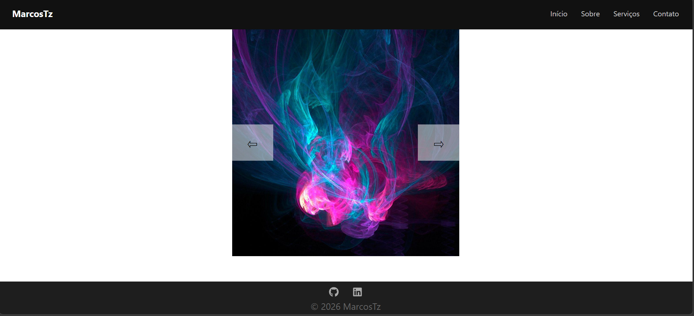
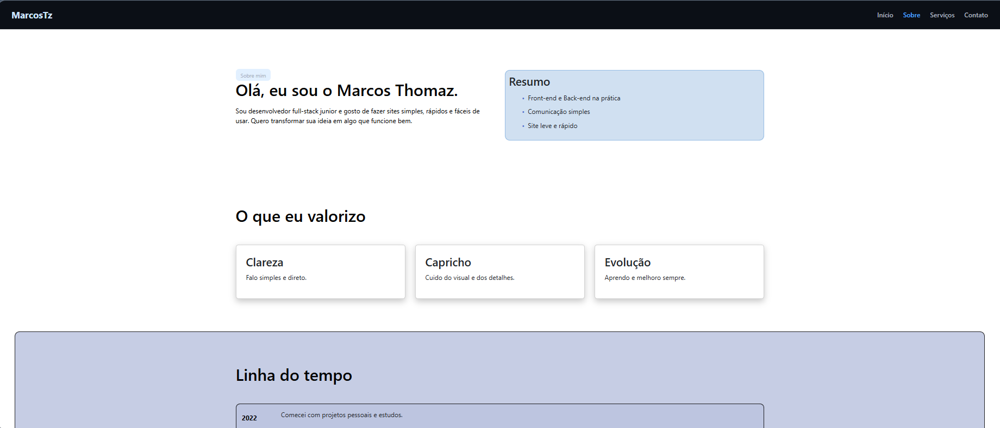
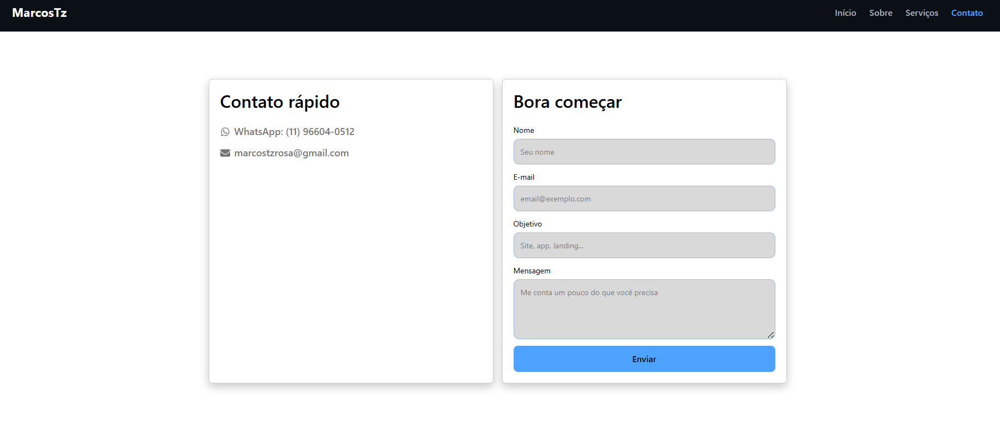

#  MarcosTz | Portfólio

Projeto de site pessoal desenvolvido com React.js.

Este site ainda está em desenvolvimento e novas funcionalidades serão adicionadas em breve.

## Preview





##  Linguagens

React.js • React Router • Bootstrap • CSS

## ▶ Como executar

```bash
npm install
npm start

Caso apareça erro no `npm install` no Windows, abra o **PowerShell como administrador** e execute:

Set-ExecutionPolicy RemoteSigned

